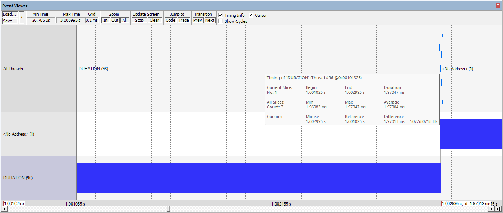

# What to do
Follow instructions.


## Choose the test

- Choose a suitable macro in file `icubtech/testcode/testcode.h`:

  ```c++
  // macros used to change the test
  
  // macros used to change the test
  
  #define DUMMY 100
  #define TEST1 1
  #define TEST2 2
  #define TEST3 3
      
  #define TESTcode TEST2
  ```
  


## Prepare the G4 FLASH test

- Move to folder `study-cm4-performances/code`.

- Clone the STM32G4 repo plus it sub modules with:

  ```bash
  $ git clone --recurse-submodules https://github.com/STMicroelectronics/STM32CubeG4
  ```

- Copy the test g4 project using following command:

  ```bash
  $ cp icubtech/projects/g4-flash-test.* STM32CubeG4/Projects/STM32G474E-EVAL/Templates/MDK-ARM
  ```

## Run the G4 FLASH test

- Open project `STM32CubeG4/Projects/STM32G474E-EVAL/Templates/MDK-ARM/g4-flash-test.uvprojx` 

- Compile the target. 

- Note that the original STM code will issue an error, so you must comment out the line 21 of file stts751.c

  ```bash
  ../../../../Drivers/BSP/Components/stts751/stts751.c(21): error: 'cmsis_iar.h' file not found
  ```

  ```c++
  /* Includes ------------------------------------------------------------------*/
  #include "stts751.h"
  // remove it to compile w/ mdk keil: #include "cmsis_iar.h"
  ```

- Flash it and start the debugger.

- The project is configured to use the `ULINK Pro Cortex debugger` because the  `ST-Link debugger` embedded in the development board is not able to transmit ITM port 1 and 31 signals to the MDK Keil environment.  

- Activate the `Event Viever`  window of MDK Keil from menu `Debug/OS Support/Event Viever` and measure time execution of the signal named `DURATION`.
  
  
  
  
  
- The default test is `TEST2` that will last about 2106 us.
  
  
  
  


## Prepare the H7 tests

- clone the STM32H7 repo plus it sub modules with:

  ```bash
  $ git clone --recurse-submodules https://github.com/STMicroelectronics/STM32CubeH7
  ```

- copy the test h7 projects both FLASH and RAM using following commands:

  ```bash
  $ cp icubtech/projects/h7-test-flash.* STM32CubeH7/Projects/STM32H745I-DISCO/Templates/BootCM4_CM7Gated/MDK-ARM
  ```
  ```bash
  $ cp icubtech/projects/h7-test-ram.* STM32CubeH7/Projects/STM32H745I-DISCO/Templates/BootCM7_CM4Gated/MDK-ARM
  ```
  
  
## Run the H7 FLASH test

- program the Option Bytes to have BCM4 = 1 (CM4 boot enabled) and BCM7 = 0 (CM7 boot disabled).

- open project `STM32CubeH7/Projects/STM32H745I-DISCO/Templates/BootCM4_CM7Gated/MDK-ARM/h7-test-flash.uvprojx` 

- compile both targets in this order: first the CM7 then the CM4. The reason is that the binary of the CM7 is copied inside the binary of the CM4 for RAM execution of the CM7 code. 

- flash the CM4 binary.
- power off and the on
- stay in target CM4 and start the debugger.

- The project is configured to use the `ST-Link debugger` that is embedded in the development board as it is powerful enough to transmit ITM port 1 and 31 signals to the MDK Keil environment.  

- Activate the `Event Viever`  window of MDK Keil from menu `Debug/OS Support/Event Viever` and measure time execution of the signal named `DURATION`.

  


- The default test is `TEST2` that will last about 1970 us.

  


## Run the H7 FLASH test @ 170 MHz

- Do as before but change the clock tree to clock the CM7 @ 340 MHz and the CM4 @ 170 MHz by defining macro `H7_CM4_AT_170MHZ`  so that the following code is enabled.

  ```c++
    RCC_OscInitStruct.PLL.PLLM = 5;
  #if defined(H7_CM4_AT_170MHZ)      
    RCC_OscInitStruct.PLL.PLLN = 136; // it reduces the clock tree from 400 to 340
  #else
    RCC_OscInitStruct.PLL.PLLN = 160;
  #endif
    RCC_OscInitStruct.PLL.PLLFRACN = 0;
    RCC_OscInitStruct.PLL.PLLP = 2;  
    RCC_OscInitStruct.PLL.PLLR = 2; 
    RCC_OscInitStruct.PLL.PLLQ = 4;
  ```

- run tests as before.

## Run the H7 RAM test

- program the Option Bytes to have BCM4 = 0 (CM4 boot disabled) and BCM7 = 1 (CM7 boot enabled).

- open project `STM32CubeH7/Projects/STM32H745I-DISCO/Templates/BootCM7_CM4Gated/MDK-ARM/h7-ram-test.uvprojx` 

- compile both targets in this order: first the CM4 then the CM7. The reason is that the binary of the CM4 is copied inside the binary of the CM7 for RAM execution of the CM4 code. 

- flash the CM7 binary.
- power off and the on

- change to target CM4 and start the debugger.

- The project is configured to use the `ST-Link debugger` that is embedded in the development board as it is powerful enough to transmit ITM port 1 and 31 signals to the MDK Keil environment.  

- Activate the `Event Viever`  window of MDK Keil from menu `Debug/OS Support/Event Viever` and measure time execution of the signal named `DURATION`.

  


- The default test is `TEST2` that will last about 1969 us.

  


## 
